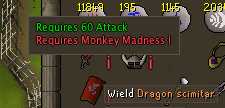
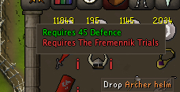
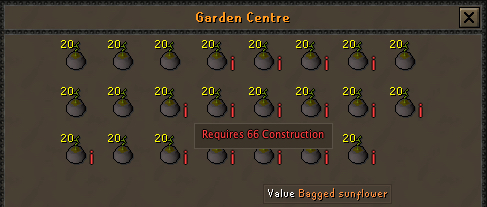
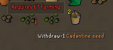

# Item Requirements Plugin

**Never guess again!**  
The **Item Requirements Plugin** is your in-game crystal ball for item eligibility. Whether you’re browsing your bank, sorting your inventory, or daydreaming in the Grand Exchange, this plugin **automatically spots items you can’t use yet, whether they’re equipment, or other special items**—then tells you *exactly* why.  

With vibrant overlays and handy tooltips, you’ll instantly see the skill levels or quests standing between you and your dream gear. It works seamlessly across most interfaces, from your worn equipment to the dusty depths of your bank.

---

## Example Screenshots

  
  

  
  
  

