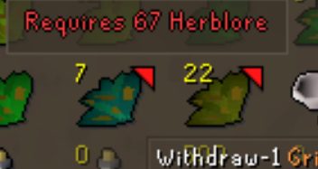
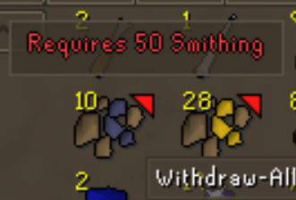

# Item Requirements Plugin

Easily check which items your character can or cannot use.  
This plugin highlights items with unmet requirements and shows exactly what skills or quests are needed.

## ✨ Features
- Highlights items you cannot use yet.
- Displays skill and quest requirements in a tooltip.
- Configurable overlay indicators (triangle color and position).
- Works in inventory, bank, equipment, shop, and GE.

## 🎮 Usage
- Hover over items to see detailed tooltips with requirements.
- Red or yellow triangle indicators show unmet requirements:
  - **Red** = No requirements met.
  - **Yellow** = Some requirements met, some unmet.
- Configure via the plugin panel to adjust appearance and behavior.

## ⚙️ Configuration
- **Tooltip text size**: Adjust font size.
- **Tooltip opacity**: Control background transparency.
- **Indicator colors**: Customize “no requirements met” and “partial requirements met” colors.
- **Triangle corner**: Choose which corner of the item icon shows the indicator.

## 🔗 Compatibility
Works seamlessly across:
- Inventory
- Bank
- Equipment
- Shops
- Grand Exchange

## 📥 Installation

Show Installation Instructions

1. Open RuneLite.  
2. Go to the Plugin Hub (wrench icon → Plugin Hub).  
3. Search for **Item Requirements**.  
4. Click **Install**.

---

## 📸 Example Screenshots

  
  
  

  
  
  

