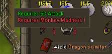
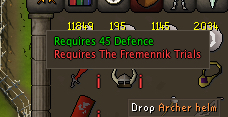
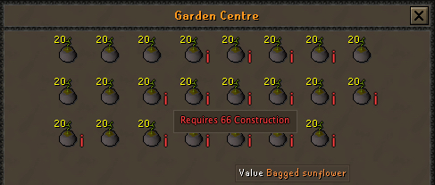
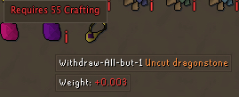
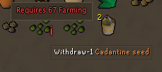

# Equipment Requirements Plugin

**Never guess again!**  
The **Equipment Requirements Plugin** is your in-game crystal ball for gear eligibility. Whether you’re browsing your bank, sorting your inventory, or daydreaming in the Grand Exchange, this plugin **automatically spots items you can’t use yet**—then tells you *exactly* why.  

With vibrant overlays and handy tooltips, you’ll instantly see the skill levels or quests standing between you and your dream gear. It works seamlessly across most interfaces, from your worn equipment to the dusty depths of your bank.  

**Perfect for:**  
- Planning your next grind without spreadsheets  
- Avoiding the heartbreak of buying gear you can’t equip  
- Feeling smug when you *do* meet the requirements  

Equip your ambitions—**literally**.  

---

## Example Screenshots

  
  

  
  
  

